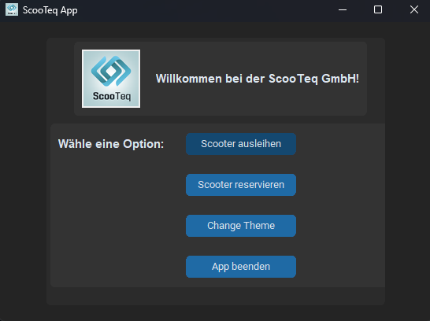
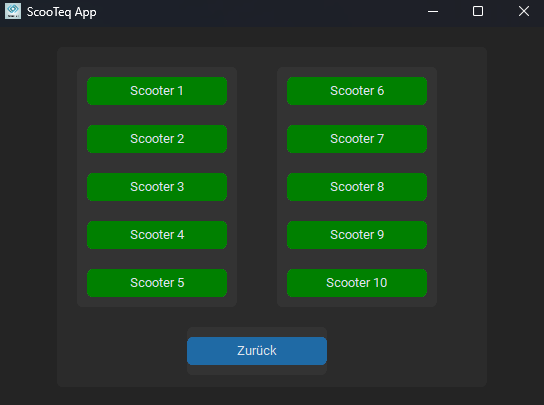
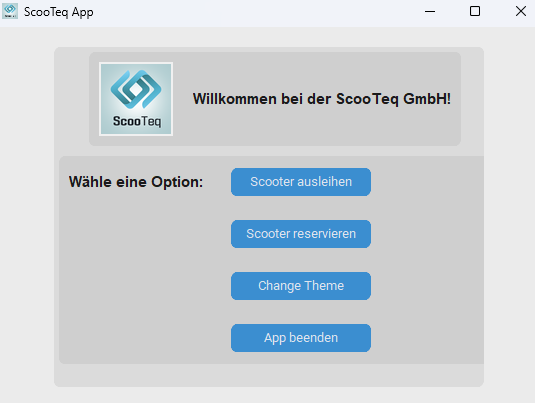

# Lernfeld 02 IT

Dies ist eine Ausarbeitung zu der zweiten Aufgabe aus Lernfeld 02, an der ITECH 14 in Hamburg/Wilhelmsburg,   
das von Gruppe 10i (Klaus Sigel, Aaron von der Dellen, Arian Vig, Lukas Danowski) bearbeitet wurde.

### Genauere Beschreibung
"Eine Anwendung zur Berechnung des Fahrpreises für die Vermietungsvorgänge"  

Die entwickelte Anwendung kann den Preis von Fahrten anhand der Buchungsdauer ausrechnen.  
Somit wird es dem Kunden einfach gemacht einen Überblick über die Preise der **ScooTeq GmbH** zu behalten.  
Darüber hinaus können Scooter auch im Voraus schon reserviert werden und Kunden können eine bessere Übersicht über die Verfügbarkeit der Scooter behalten.  

Als Kunde von **ScooTeq** haben sie also keinen Grund sich die App nicht sofort herunterzuladen.

### Bilder der Anwendung

**So sieht die Startseite unserer Anwendung aus:**

**Bei uns kannst du mehrere Scooter gleichzeitig ausleihen oder reservieren:**

**Auch für Menschen den "light-mode" bevorzugen kommen bei uns auf ihre kosten:**

### Upcomming Features
- Sortierung nach der Entfernung
- LogIn erstellen
- Datenbank einhängen

### Development Requirements

- [Python](https://www.python.org/downloads/)
- [Git](https://git-scm.com/download)
- Eine IDE z.B. [VS Code](https://code.visualstudio.com/) oder [PyCharm](https://www.jetbrains.com/de-de/pycharm/download/?section=windows)

### pip install requierments

- `pip install Pillow`
- `pip install customtkinter`

### Tipps

Den Python Interpreter findet man hier "C:\Users\BENUTZER_NAME\AppData\Local\Programs\Python"